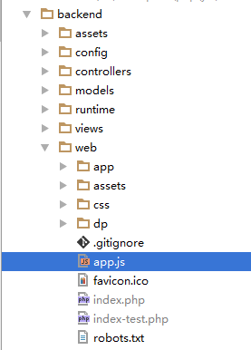

自定义命名空间
=========

配置
------------

> 此处以网站根目录的`app.js`为例

`@app/config/main.php`

`@app`指你应用的目录 比如你访问的是`backend/web/index.php`那么你就配置`backend/config/main.php`即可
反之你访问的是`frontend/web/index.php`那么你就配置`frontend/config/main.php`即可

高级版是`main.php`

基础版是`web.php`

```
'controllerMap' => [
    'site' => [
        'class' => '\wsl\rbac\controllers\SiteController',
        'extJs' => [
            'path' => '/app.js',
        ],
    ],
    ...
],
```

`app.js`文件代码

> 此处以命名空间`MDP`为例

```javascript
Ext.Loader.setConfig({
    enable: true,
    paths: {
        'DP': extJsConfig['extendPath']
    }
});
Ext.application({
    name: 'MDP',

    extend: 'DP.Application'
});

```

**目录结构**

